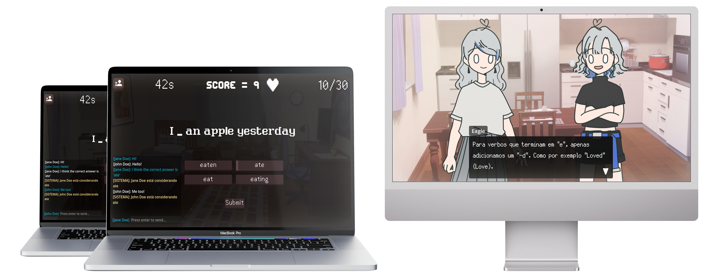

# Project Kiwi

Educational English-learning game designed for Brazilian high school students, combining a narrative-driven story mode with an arcade-style multiplayer experience. It explores the impact of synchronous multiplayer gameplay compared to single-player modes on students’ language acquisition and attitudes toward learning.



## Local installation


<details>
<summary><strong>Export game</strong></summary>

To run this game locally, please follow these steps:

1. Clone the repository:

```bash
git clone <repository-url>
```

2. Open Godot
3. Click on the `Import` button
4. Navigate to the project directory
5. Click on the `Import and edit button`

</details>

<details>
<summary><strong>Run multiplayer server</strong></summary>

To run this game server locally, please follow these steps:

1. Clone the repository:
```bash
git clone <repository-url>
```

2. Make sure the folder `.\data` is included

3. Run the docker compose:
```bash
docker compose up
```

4. When all player entered session, start game with `start_game_notification_lua` script
</details>

## License

Code released under the [MIT License](LICENSE)
